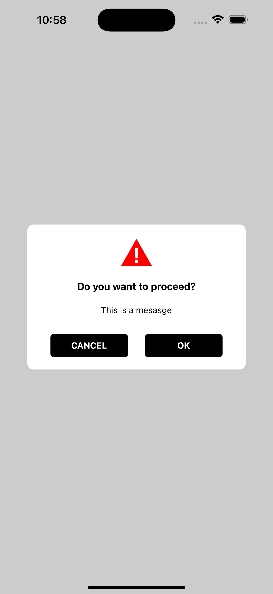

# MobikulAlert

A customizable alert modal component for React Native applications. Easily display alerts with titles, messages, and customizable buttons.
To find out more [mobikul.com](https://mobikul.com/)

 <!-- Smaller image -->
## Installation

Install the package using npm:

```bash
npm install mobikul-custom-alert
```

or using yarn:

```bash
yarn add mobikul-custom-alert
```

## Usage

Import `MobikulAlert` into your React Native component and use it as follows:

```javascript
import React, { useState } from 'react';
import { Button, View } from 'react-native';
import MobikulAlert from 'mobikul-alert';

const App = () => {
  const [isVisible, setIsVisible] = useState(false);

  const showAlert = () => setIsVisible(true);
  const hideAlert = () => setIsVisible(false);

  return (
    <View style={{ flex: 1, justifyContent: 'center', alignItems: 'center' }}>
      <Button title="Show Alert" onPress={showAlert} />

      <MobikulAlert
        visible={isVisible}
        onCancel={hideAlert}
        title="Are you sure?"
        message="This action cannot be undone."
        buttons={[
          {
            title: 'Cancel',
            callback: hideAlert,
          },
          {
            title: 'Confirm',
            callback: () => {
              console.log('Confirmed!');
              hideAlert();
            },
          },
        ]}
      />
    </View>
  );
};

export default App;
```

## Props

| Prop Name         | Type                          | Default Value               | Description                                                                 |
|-------------------|-------------------------------|-----------------------------|-----------------------------------------------------------------------------|
| `visible`         | `boolean`                     | `false`                     | Controls the visibility of the alert modal.                                 |
| `onCancel`        | `() => void`                  | `undefined`                 | Callback function when the overlay or cancel button is pressed.             |
| `title`           | `string`                      | `'Do you want to proceed?'` | The title of the alert.                                                     |
| `message`         | `string`                      | `''`                        | The message displayed in the alert.                                         |
| `buttons`         | `Array<{ title: string, callback?: (e: GestureResponderEvent) => void }>` | `[{ title: 'Cancel' }, { title: 'Ok' }]` | Array of buttons with titles and optional callbacks. |
| `titleTextStyle`  | `StyleProp<TextStyle>`        | `styles.titleStyle`         | Custom style for the title text.                                            |
| `messageTextStyle`| `StyleProp<TextStyle>`        | `styles.message`            | Custom style for the message text.                                          |
| `buttonTextStyle` | `StyleProp<TextStyle>`        | `styles.buttonTextStyle`    | Custom style for the button text.                                           |
| `buttonStyle`     | `StyleProp<ViewStyle>`        | `styles.okButton`           | Custom style for the button container.                                      |
| `iconVisible`     | `boolean`                     | `true`                      | Whether to display the icon in the alert.                                   |

## Customization

You can customize the appearance of the alert by passing custom styles to the `titleTextStyle`, `messageTextStyle`, `buttonTextStyle`, and `buttonStyle` props.

## Example

```javascript
<MobikulAlert
  visible={isVisible}
  onCancel={hideAlert}
  title="Warning!"
  message="This is a custom alert message."
  buttons={[
    {
      title: 'No',
      callback: hideAlert,
    },
    {
      title: 'Yes',
      callback: () => {
        console.log('Yes clicked!');
        hideAlert();
      },
    },
  ]}
  titleTextStyle={{ color: 'red', fontSize: 20 }}
  messageTextStyle={{ color: 'black', fontSize: 16 }}
  buttonTextStyle={{ color: 'white' }}
  buttonStyle={{ backgroundColor: 'green', padding: 10 }}
  iconVisible={false}
/>
```

## Contributing

Contributions are welcome! Please open an issue or submit a pull request for any improvements or bug fixes.

## License

This project is licensed under the MIT License. See the [LICENSE](LICENSE) file for details.

---


Give us a like and share it with your friends


